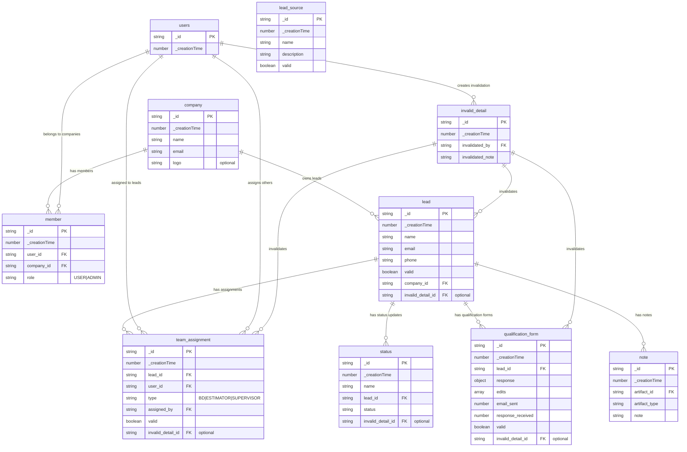

# Database Schema Documentation

## Overview

This document provides a comprehensive overview of the Xylor Estimator Convex database schema, including table structures, relationships, and business logic.

## Entity Relationship Diagram



## Table Definitions

### Core Business Tables

#### `company`

Stores company/organization information.

**Fields:**

- `name` (string): Company name
- `email` (string): Company email address (unique)
- `logo` (optional string): Company logo URL

**Indexes:**

- `by_email`: Unique lookup by email address

#### `member`

Junction table linking users to companies with role-based access.

**Fields:**

- `user_id` (Id<"users">): Reference to user
- `company_id` (Id<"company">): Reference to company
- `role` ("USER" | "ADMIN"): User's role within the company

**Indexes:**

- `by_user_id`: Find all companies for a user
- `by_company_id`: Find all members of a company
- `by_user_and_company`: Unique constraint for user-company pairs
- `by_company_and_role`: Filter members by role within a company

#### `lead`

Central entity representing potential business leads.

**Fields:**

- `name` (string): Lead's name
- `email` (string): Lead's email address
- `phone` (string): Lead's phone number
- `valid` (boolean): Whether the lead is currently valid/active
- `company_id` (Id<"company">): Which company owns this lead
- `invalid_detail` (optional Id<"invalid_detail">): Reason for invalidation

**Indexes:**

- `by_company_id`: All leads for a company
- `by_email`: Find lead by email
- `by_valid_and_company_id`: Filter active leads by company

### Team Management

#### `team_assignment`

Assigns users to leads with specific roles in the workflow.

**Fields:**

- `lead_id` (Id<"lead">): The lead being worked on
- `user_id` (Id<"users">): The assigned user
- `type` ("BD" | "ESTIMATOR" | "SUPERVISOR"): Role type
- `assigned_by` (Id<"users">): Who made the assignment
- `valid` (boolean): Whether assignment is active
- `invalid_detail` (optional Id<"invalid_detail">): Reason for invalidation

**Indexes:**

- `by_lead_id`: All assignments for a lead
- `by_user_id`: All assignments for a user
- `by_assigned_by`: Track who made assignments
- `by_valid_and_lead_id`: Active assignments per lead

**Business Logic:**

- **BD (Business Development)**: Initial lead contact and qualification
- **ESTIMATOR**: Technical assessment and cost estimation
- **SUPERVISOR**: Quality control and approval

### Lead Processing

#### `lead_source`

Categorizes where leads originate from.

**Fields:**

- `name` (string): Source name
- `description` (string): Source description
- `valid` (boolean): Whether source is actively used

**Indexes:**

- `by_valid`: Filter active lead sources

#### `status`

Tracks lead progression through the pipeline.

**Fields:**

- `name` (string): Status name/label
- `lead_id` (Id<"lead">): Associated lead
- `status` (string): Current status value
- `invalid_detail` (optional Id<"invalid_detail">): Invalidation reason

**Indexes:**

- `by_lead_id`: Status history for a lead
- `by_status_and_lead_id`: Find specific status within a lead

#### `qualification_form`

Stores lead qualification questionnaire responses.

**Fields:**

- `lead_id` (Id<"lead">): Associated lead
- `response` (object): Structured qualification data
  - `funding_secured` (boolean): Financial readiness
  - `council_license_approved` (boolean): Regulatory approval status
  - `plan_pdf_available` (boolean): Technical documentation availability
  - `additional_notes` (string): Free-form notes
  - `lead_assets` (array): Related documents and links
- `edits` (array): Audit trail of changes
- `email_sent` (number): Timestamp when form was sent
- `response_received` (number): Timestamp when response was received
- `valid` (boolean): Whether form data is current
- `invalid_detail` (optional Id<"invalid_detail">): Invalidation reason

**Indexes:**

- `by_lead_id`: Forms for a lead
- `by_valid_and_lead_id`: Active forms per lead

### Support Tables

#### `invalid_detail`

Centralized invalidation tracking for soft deletes.

**Fields:**

- `invalidated_by` (Id<"users">): Who performed the invalidation
- `invalidated_note` (string): Reason for invalidation

**Usage Pattern:**
Instead of hard deletes, records are marked as `valid: false` and linked to an invalidation record for audit purposes.

#### `note`

Generic note system for attaching comments to various entities.

**Fields:**

- `artifact_id` (Id): Reference to any entity (polymorphic)
- `artifact_type` (string): Type identifier (e.g., "lead")
- `note` (string): Note content

**Indexes:**

- `by_artifact_id`: All notes for an entity
- `by_artifact_type_and_id`: Notes filtered by entity type

## Relationship Patterns

### Company-Centric Organization

- Companies own leads and have members with defined roles
- All business operations are scoped to company boundaries
- Members can have different access levels (USER vs ADMIN)

### Lead Lifecycle Management

1. **Lead Creation**: Associated with a company
2. **Team Assignment**: BD, Estimator, and Supervisor roles assigned
3. **Qualification**: Forms sent and responses collected
4. **Status Tracking**: Progress through pipeline stages
5. **Documentation**: Notes and assets attached throughout

### Data Integrity Patterns

- **Soft Deletes**: Uses `valid` flags with `invalid_detail` references
- **Audit Trails**: Edit history in qualification forms
- **User Attribution**: Tracks who performed actions (assignments, invalidations)

## Common Query Patterns

### Active Leads for Company

```sql
-- Find all valid leads for a company
WHERE company_id = ? AND valid = true
INDEX: by_valid_and_company_id
```

### User's Current Assignments

```sql
-- Get active assignments for a user
WHERE user_id = ? AND valid = true
INDEX: by_user_id (with filter)
```

### Lead Team Composition

```sql
-- Find all team members for a lead
WHERE lead_id = ? AND valid = true
INDEX: by_valid_and_lead_id
```

### Lead Status History

```sql
-- Get status progression for a lead
WHERE lead_id = ?
ORDER BY _creationTime
INDEX: by_lead_id
```

## Security Considerations

- Company-based data isolation through `company_id` scoping
- Role-based access control via `member.role`
- User attribution for all modifications
- Soft delete pattern preserves audit trails
- Invalidation reasons tracked for compliance

## Performance Optimizations

- Compound indexes for common filter patterns
- Separate valid/invalid filtering to avoid table scans
- Denormalized status tracking for quick pipeline queries
- Efficient user-company-role lookups for authorization
