# Estimation System Schema Documentation

## Overview

The estimation system supports four main workflows for creating comprehensive construction estimates. The schema is designed with partial data support, allowing users to save progress at any stage of the estimation process.

## Database Schema Diagram

```mermaid
erDiagram
    %% External referenced tables (not part of this schema)
    lead {
        id id PK
        company_id string
        title string
        status string
    }

    company {
        id id PK
        name string
        domain string
    }

    users {
        id id PK
        name string
        email string
        company_id string
    }

    invalid_detail {
        id id PK
        reason string
        timestamp number
    }

    %% Main estimation tables
    estimate {
        id id PK
        lead_id id FK "Links to lead"
        project_name string "Optional project name"
        date_created number "Optional creation timestamp"
        project_duration number "Optional calculated duration"
        status string "Optional DRAFT|IN_PROGRESS|SUBMITTED|APPROVED|REJECTED"
        version number "Required version control default 1"
        created_by id FK "Creator user"
        company_id id FK "Company association"
        valid boolean "Soft delete flag"
        invalid_detail id FK "Optional invalidation reason"
    }

    estimate_components {
        id id PK
        estimate_id id FK "Links to estimate"
        house_type string "Optional TYPE_A to TYPE_G"
        house_count number "Optional number of houses"
        quality string "Optional PREMIUM|STANDARD|BUDGET"
        gia number "Optional Gross Internal Area"
        external_walls number "Optional external wall count"
        upper_gables number "Optional upper gable count"
        internal_bearing_walls number "Optional bearing wall count"
        internal_partition_walls number "Optional partition wall count"
        floor_cassettes number "Optional floor cassette count"
        roof_cassettes number "Optional roof cassette count"
        ceiling_cassettes number "Optional ceiling cassette count"
        stair_cases number "Optional staircase count"
        windows_external_doors number "Optional window and door count"
        internal_doors number "Optional internal door count"
        total_cost number "Optional calculated total cost"
        total_per_m2 number "Optional calculated cost per m2"
        last_updated number "Optional update timestamp"
        updated_by id FK "Optional last updater"
    }

    estimate_installation {
        id id PK
        estimate_id id FK "Links to estimate"
        units_count number "Optional unit count"
        days_per_unit number "Optional days per unit"
        total_days number "Optional calculated total days"
        site_supervisor_count number "Optional supervisor count"
        installer_sr_count number "Optional senior installer count"
        installer_jr_count number "Optional junior installer count"
        occasional_la_count number "Optional laborer count"
        site_supervisor_total_days number "Optional calculated supervisor days"
        installer_sr_total_days number "Optional calculated sr installer days"
        installer_jr_total_days number "Optional calculated jr installer days"
        occasional_la_total_days number "Optional calculated laborer days"
        accommodation_days number "Optional accommodation days"
        travel_cost number "Optional travel expenses"
        contingency_percentage number "Optional contingency percentage"
        contingency_amount number "Optional calculated contingency"
        total_team_cost number "Optional calculated team cost"
        team_cost_per_m2 number "Optional calculated cost per m2"
        transport_miles number "Optional transport distance"
        cost_per_mile number "Optional cost per mile"
        number_of_trucks number "Optional calculated truck count"
        total_truck_cost number "Optional calculated truck cost"
        crane_days number "Optional crane days needed"
        crane_cost_per_day number "Optional daily crane cost"
        total_crane_cost number "Optional calculated crane cost"
        last_updated number "Optional update timestamp"
        updated_by id FK "Optional last updater"
    }

    estimate_cost_plan {
        id id PK
        estimate_id id FK "Links to estimate"
        components_subtotal number "Optional from workflow 1"
        other_components number "Optional additional components"
        risk_fx_percentage number "Optional risk and FX percentage"
        risk_fx_amount number "Optional calculated risk amount"
        margin_percentage number "Optional profit margin percentage"
        margin_amount number "Optional calculated margin"
        components_total number "Optional calculated total"
        extras_stair_cases number "Optional extra staircase costs"
        extras_windows_doors number "Optional extra window costs"
        extras_internal_doors number "Optional extra door costs"
        site_management_rate number "Optional daily management rate"
        site_management_total number "Optional calculated management total"
        transport_total number "Optional from workflow 2"
        sub_total_components number "Optional calculated subtotal"
        abnormals_percentage number "Optional abnormal conditions percentage"
        abnormals_amount number "Optional calculated abnormals"
        final_components_total number "Optional calculated final total"
        installation_total number "Optional from workflow 2"
        crane_operator_total number "Optional from workflow 2"
        super_structure_total number "Optional calculated grand total"
        last_updated number "Optional update timestamp"
        updated_by id FK "Optional last updater"
    }

    estimate_final {
        id id PK
        estimate_id id FK "Links to estimate"
        building_components_total number "Optional from workflow 3"
        additional_stairs number "Optional extra staircase costs"
        additional_windows number "Optional extra window costs"
        additional_internal_doors number "Optional extra door costs"
        additional_transport number "Optional extra transport costs"
        additional_site_management number "Optional extra management costs"
        additional_abnormals number "Optional extra abnormal costs"
        final_installation number "Optional final installation costs"
        final_crane_operator number "Optional final crane costs"
        project_design_fee_per_unit number "Optional design fee per unit"
        project_design_fee_total number "Optional calculated design total"
        project_management_fee_monthly number "Optional monthly PM fee"
        ohp_percentage number "Optional overheads and profit percentage"
        ohp_amount number "Optional calculated OHP amount"
        grand_total number "Optional calculated grand total"
        grand_total_per_m2 number "Optional calculated total per m2"
        last_updated number "Optional update timestamp"
        updated_by id FK "Optional last updater"
    }

    estimate_calculations {
        id id PK
        estimate_id id FK "Links to estimate"
        workflow_step string "COMPONENTS|INSTALLATION|COST_PLAN|FINAL"
        field_name string "Name of calculated field"
        calculation_formula string "Formula or method used"
        input_values any "JSON object of input values"
        result_value number "The calculated result"
        calculated_at number "Calculation timestamp"
        calculated_by id FK "User who triggered calculation"
    }

    estimate_override_edits {
        id id PK
        estimate_id id FK "Links to estimate"
        _v number "Version number"
        label string "Description of the edit"
        old_value string "Previous value as string"
        new_value string "New value as string"
        edited_by id FK "User who made the edit"
        edited_at number "Edit timestamp"
    }

    cost_lookup {
        id id PK
        category string "Category like house_type quality staff_rates"
        key string "Specific key like TYPE_A PREMIUM site_supervisor"
        base_cost number "Base cost for item"
        cost_per_unit number "Optional per-unit cost for scalable items"
        currency string "Currency code like GBP USD"
        effective_date number "When pricing becomes effective"
        expires_date number "Optional expiration date"
        company_id id FK "Optional company-specific pricing"
        created_by id FK "User who created pricing"
        valid boolean "Soft delete flag"
    }

    %% Relationships
    lead ||--o{ estimate : "has estimates"
    company ||--o{ estimate : "owns estimates"
    users ||--o{ estimate : "creates estimates"
    invalid_detail ||--o| estimate : "invalidation reason"

    estimate ||--o| estimate_components : "has components"
    estimate ||--o| estimate_installation : "has installation"
    estimate ||--o| estimate_cost_plan : "has cost plan"
    estimate ||--o| estimate_final : "has final estimate"
    estimate ||--o{ estimate_calculations : "has calculations"
    estimate ||--o{ estimate_override_edits : "has edit history"

    users ||--o{ estimate_components : "updates"
    users ||--o{ estimate_installation : "updates"
    users ||--o{ estimate_cost_plan : "updates"
    users ||--o{ estimate_final : "updates"
    users ||--o{ estimate_calculations : "triggers calculation"
    users ||--o{ estimate_override_edits : "makes edits"
    users ||--o{ cost_lookup : "creates pricing"

    company ||--o{ cost_lookup : "has pricing"
```



## Core Design Principles

### 1. Partial Data Support

- All fields (except essential identifiers) are optional using `v.optional()`
- Users can save incomplete estimates and continue later
- Each workflow can be completed independently

### 2. Workflow Separation

- Each workflow has its own dedicated table
- Clear separation of concerns between estimation phases
- Independent data validation for each workflow step

### 3. Audit Trail & Versioning

- Complete history tracking of all changes through `estimate_override_edits`
- Calculation audit trail for transparency via `estimate_calculations`
- Version control for estimate iterations

### 4. Integration with Existing System

- Links to existing `lead` system via `lead_id`
- Uses existing `company` and `users` tables
- Follows established invalidation patterns with `valid` flag

## Validation Enums

The schema defines several enums for data validation:

### House Types

```typescript
"TYPE_A" | "TYPE_B" | "TYPE_C" | "TYPE_D" | "TYPE_E" | "TYPE_F" | "TYPE_G";
```

### Quality Levels

```typescript
"PREMIUM" | "STANDARD" | "BUDGET";
```

### Estimate Status

```typescript
"DRAFT" | "IN_PROGRESS" | "SUBMITTED" | "APPROVED" | "REJECTED";
```

### Workflow Steps

```typescript
"COMPONENTS" | "INSTALLATION" | "COST_PLAN" | "FINAL";
```

## Database Tables

### 1. `estimate` (Main Table)

**Purpose**: Central estimate record linking to existing lead system

```typescript
{
  lead_id: Id<"lead">                    // Links to existing lead
  project_name?: string                  // Optional project name
  date_created?: number                  // Timestamp of creation
  project_duration?: number              // Calculated duration in days
  status?: EstimateStatus               // Current status
  version: number                       // Version control (required, default: 1)
  created_by: Id<"users">              // Creator user ID
  company_id: Id<"company">            // Company association
  valid: boolean                        // Soft delete pattern
  invalid_detail?: Id<"invalid_detail"> // Optional invalidation reason
}
```

**Key Indexes**:

- `by_lead_id`: Get estimates for a lead
- `by_company_id`: Company-scoped estimates
- `by_valid_and_lead_id`: Valid estimates for a lead
- `by_created_by`: Estimates by creator
- `by_status`: Filter by estimate status
- `by_lead_and_version`: Version management for lead estimates

### 2. `estimate_components` (Workflow 1)

**Purpose**: House components and measurements

```typescript
{
  estimate_id: Id<"estimate">           // Links to main estimate

  // House Type Selection (only 1 allowed)
  house_type?: HouseType               // Single house type selection
  house_count?: number                 // Number of houses

  // Quality Selection
  quality?: QualityLevel               // Quality tier selection

  // Measurements/Totals - all optional for partial data entry
  gia?: number                         // Gross Internal Area (sqm)
  external_walls?: number              // External wall count/area
  upper_gables?: number                // Upper gable count
  internal_bearing_walls?: number      // Internal bearing wall count
  internal_partition_walls?: number    // Internal partition wall count
  floor_cassettes?: number             // Floor cassette count
  roof_cassettes?: number              // Roof cassette count
  ceiling_cassettes?: number           // Ceiling cassette count
  stair_cases?: number                 // Staircase count
  windows_external_doors?: number      // Window and external door count
  internal_doors?: number              // Internal door count

  // Cost Calculations (user editable with validation)
  total_cost?: number                  // Total component cost
  total_per_m2?: number                // Cost per square meter

  // Metadata
  last_updated?: number                // Last update timestamp
  updated_by?: Id<"users">            // Last updater
}
```

**Indexes**:

- `by_estimate_id`: Get components for estimate
- `by_house_type`: Filter by house type
- `by_quality`: Filter by quality level

**Business Rules**:

- Only one house type can be selected per estimate
- All measurement fields are optional for progressive data entry
- Cost calculations can be manually overridden

### 3. `estimate_installation` (Workflow 2)

**Purpose**: Installation team and logistics planning

```typescript
{
  estimate_id: Id<"estimate">           // Links to main estimate

  // Team Configuration
  units_count?: number                  // Number of units to install
  days_per_unit?: number               // Installation days per unit
  total_days?: number                  // Calculated: units_count * days_per_unit

  // Staff Assignments
  site_supervisor_count?: number       // Number of site supervisors
  installer_sr_count?: number          // Senior installer count
  installer_jr_count?: number          // Junior installer count
  occasional_la_count?: number         // Occasional laborer count

  // Staff Total Days (calculated fields)
  site_supervisor_total_days?: number
  installer_sr_total_days?: number
  installer_jr_total_days?: number
  occasional_la_total_days?: number

  // Additional Costs
  accommodation_days?: number           // Accommodation days (typically = total_days)
  travel_cost?: number                 // Travel expenses
  contingency_percentage?: number       // Contingency as percentage
  contingency_amount?: number          // Calculated contingency cost

  // Team Cost Summary
  total_team_cost?: number             // Total team labor cost
  team_cost_per_m2?: number            // Team cost per square meter

  // Delivery & Transport
  transport_miles?: number             // Distance for transport
  cost_per_mile?: number               // Cost per mile for transport
  number_of_trucks?: number            // Number of trucks needed (~25 sqm capacity each)
  total_truck_cost?: number            // Calculated: miles * trucks * cost_per_mile

  // Crane & Operator
  crane_days?: number                  // Days crane is needed
  crane_cost_per_day?: number          // Daily crane cost
  total_crane_cost?: number            // Calculated: crane_days * crane_cost_per_day

  // Metadata
  last_updated?: number
  updated_by?: Id<"users">
}
```

**Indexes**:

- `by_estimate_id`: Get installation data for estimate

**Calculation Rules**:

- `total_days = units_count * days_per_unit`
- `accommodation_days` typically equals `total_days`
- `contingency_amount = (base_costs) * contingency_percentage`
- `number_of_trucks = ceil(total_area / 25)` (approximately)
- `total_truck_cost = transport_miles * number_of_trucks * cost_per_mile`
- `total_crane_cost = crane_days * crane_cost_per_day`

### 4. `estimate_cost_plan` (Workflow 3)

**Purpose**: Cost planning and summary calculations

```typescript
{
  estimate_id: Id<"estimate">           // Links to main estimate

  // Components Section (from Workflow 1)
  components_subtotal?: number          // Base components cost
  other_components?: number             // Additional components

  // Risk & FX
  risk_fx_percentage?: number           // Risk and foreign exchange percentage
  risk_fx_amount?: number               // Calculated risk/FX cost

  // Margin on Product
  margin_percentage?: number            // Profit margin percentage
  margin_amount?: number                // Calculated margin amount

  // Components Total
  components_total?: number             // subtotal + other + risk_fx + margin

  // Extras Section
  extras_stair_cases?: number           // Additional staircase costs
  extras_windows_doors?: number         // Additional window/door costs
  extras_internal_doors?: number        // Additional internal door costs
  site_management_rate?: number         // Daily site management rate
  site_management_total?: number        // rate * total_days from installation
  transport_total?: number              // Transport costs from Workflow 2

  // Sub Total Components
  sub_total_components?: number         // Sum of components + extras

  // Abnormals
  abnormals_percentage?: number         // Abnormal conditions percentage
  abnormals_amount?: number             // percentage * sub_total_components

  // Final Components Total
  final_components_total?: number       // sub_total + abnormals

  // Installation & Delivery (from Workflow 2)
  installation_total?: number           // Total installation costs
  crane_operator_total?: number         // Crane and operator costs

  // Super Structure Construction Costs
  super_structure_total?: number        // Grand total of all above

  // Metadata
  last_updated?: number
  updated_by?: Id<"users">
}
```

**Indexes**:

- `by_estimate_id`: Get cost plan for estimate

### 5. `estimate_final` (Workflow 4)

**Purpose**: Final estimate sheet with all costs and project fees

```typescript
{
  estimate_id: Id<"estimate">           // Links to main estimate

  // Building Components (from Workflow 3)
  building_components_total?: number    // Total from cost plan

  // Additional Supplied Items
  additional_stairs?: number            // Extra staircase costs
  additional_windows?: number           // Extra window costs
  additional_internal_doors?: number    // Extra door costs
  additional_transport?: number         // Extra transport costs
  additional_site_management?: number   // Extra site management
  additional_abnormals?: number         // Extra abnormal condition costs

  // Installation
  final_installation?: number           // Final installation costs
  final_crane_operator?: number         // Final crane/operator costs

  // Project Fees
  project_design_fee_per_unit?: number  // Design fee per unit
  project_design_fee_total?: number     // Total design fees
  project_management_fee_monthly?: number // Monthly PM fee

  // OHP (Overheads and Profit)
  ohp_percentage?: number               // Overhead and profit percentage
  ohp_amount?: number                   // Calculated OHP amount

  // Grand Total
  grand_total?: number                  // Final total cost
  grand_total_per_m2?: number           // Final cost per square meter

  // Metadata
  last_updated?: number
  updated_by?: Id<"users">
}
```

**Indexes**:

- `by_estimate_id`: Get final estimate for estimate

### 6. `estimate_calculations` (Audit Trail)

**Purpose**: Track how calculated values were computed for transparency and debugging

```typescript
{
  estimate_id: Id<"estimate">; // Links to main estimate
  workflow_step: WorkflowStep; // Which workflow step the calculation belongs to
  field_name: string; // Name of the calculated field
  calculation_formula: string; // Formula or method used
  input_values: any; // JSON object of input values used
  result_value: number; // The calculated result
  calculated_at: number; // Timestamp when calculated
  calculated_by: Id<"users">; // User who triggered the calculation
}
```

**Indexes**:

- `by_estimate_id`: All calculations for an estimate
- `by_workflow_step`: Calculations by workflow
- `by_estimate_and_step`: Calculations for estimate + specific workflow
- `by_field_name`: Find calculations for specific fields

### 7. `estimate_override_edits` (Change Tracking)

**Purpose**: Track manual edits and overrides for audit purposes

```typescript
{
  estimate_id: Id<"estimate">; // Links to main estimate
  _v: number; // Version number
  label: string; // Description of the edit
  old_value: string; // Previous value (as string)
  new_value: string; // New value (as string)
  edited_by: Id<"users">; // User who made the edit
  edited_at: number; // Timestamp of edit
}
```

**Indexes**:

- `by_estimate_id`: All edits for an estimate
- `by_edited_by`: Edits by user
- `by_edited_at`: Edits by timestamp

### 8. `cost_lookup` (Pricing Tables)

**Purpose**: Standardized pricing for consistent estimates across the organization

```typescript
{
  category: string                      // Category like "house_type", "quality", "staff_rates"
  key: string                          // Specific key like "TYPE_A", "PREMIUM", "site_supervisor"
  base_cost: number                    // Base cost for this item
  cost_per_unit?: number               // Optional per-unit cost for scalable items
  currency: string                     // Currency code like "GBP", "USD"
  effective_date: number               // When this pricing becomes effective
  expires_date?: number                // Optional expiration date
  company_id?: Id<"company">           // Optional company-specific pricing
  created_by: Id<"users">             // Who created this pricing entry
  valid: boolean                       // Soft delete flag
}
```

**Indexes**:

- `by_category`: Get all items in a category
- `by_category_and_key`: Get specific item pricing
- `by_company_id`: Company-specific pricing
- `by_valid`: Only active pricing
- `by_effective_date`: Time-based pricing queries

## Workflow Implementation Guide

### Workflow 1: Components

1. Create main `estimate` record with `lead_id`, `company_id`, `created_by`
2. Create `estimate_components` record linked to estimate
3. Select house type and quality level
4. Enter measurements progressively (all optional)
5. Calculate and validate total costs
6. Save progress at any stage

### Workflow 2: Installation

1. Create `estimate_installation` record linked to existing estimate
2. Configure team size (`units_count`, `days_per_unit`)
3. Assign staff counts (supervisors, installers, laborers)
4. Calculate staff total days automatically
5. Add transport details (miles, trucks, costs)
6. Configure crane requirements
7. Calculate contingency and total costs

### Workflow 3: Cost Plan Summary

1. Create `estimate_cost_plan` record
2. Pull component totals from Workflow 1
3. Apply risk factors and profit margins
4. Add extras (stairs, windows, doors, site management)
5. Calculate abnormal condition costs
6. Pull installation costs from Workflow 2
7. Generate final component totals

### Workflow 4: Final Estimate

1. Create `estimate_final` record
2. Consolidate all costs from previous workflows
3. Add any additional supplied items
4. Calculate project design and management fees
5. Apply overheads and profit (OHP)
6. Generate grand totals and per-m² costs

## Data Validation Patterns

### Cost Override Validation

When users manually override calculated costs, the system should:

1. Log the override in `estimate_override_edits`
2. Require justification for significant deviations
3. Flag estimates with overrides for review

### Calculation Integrity

All calculated fields should:

1. Log calculation details in `estimate_calculations`
2. Store the formula and input values used
3. Allow recalculation if inputs change
4. Maintain audit trail of who triggered calculations

### Version Management

Major changes to estimates should:

1. Increment the version number in the main `estimate` record
2. Create detailed change logs in `estimate_override_edits`
3. Preserve historical data for comparison

## Query Patterns

### Get Complete Estimate Data

```typescript
const estimate = await ctx.db.get(estimate_id);
const components = await ctx.db
  .query("estimate_components")
  .withIndex("by_estimate_id", (q) => q.eq("estimate_id", estimate_id))
  .unique();
const installation = await ctx.db
  .query("estimate_installation")
  .withIndex("by_estimate_id", (q) => q.eq("estimate_id", estimate_id))
  .unique();
const costPlan = await ctx.db
  .query("estimate_cost_plan")
  .withIndex("by_estimate_id", (q) => q.eq("estimate_id", estimate_id))
  .unique();
const final = await ctx.db
  .query("estimate_final")
  .withIndex("by_estimate_id", (q) => q.eq("estimate_id", estimate_id))
  .unique();
```

### Get Company Estimates

```typescript
const estimates = await ctx.db
  .query("estimate")
  .withIndex("by_company_id", (q) => q.eq("company_id", company_id))
  .filter((q) => q.eq(q.field("valid"), true))
  .collect();
```

### Get Calculation History

```typescript
const calculations = await ctx.db
  .query("estimate_calculations")
  .withIndex("by_estimate_and_step", (q) =>
    q.eq("estimate_id", estimate_id).eq("workflow_step", "COMPONENTS"),
  )
  .order("desc")
  .collect();
```

### Get Pricing Information

```typescript
const houseTypePricing = await ctx.db
  .query("cost_lookup")
  .withIndex("by_category_and_key", (q) =>
    q.eq("category", "house_type").eq("key", "TYPE_A"),
  )
  .filter((q) => q.eq(q.field("valid"), true))
  .first();
```

## Best Practices

1. **Progressive Data Entry**: Allow users to save incomplete estimates and continue later
2. **Validation at Boundaries**: Validate data when moving between workflows
3. **Audit Everything**: Log all calculations and manual overrides
4. **Soft Deletes**: Use the `valid` flag instead of hard deletes
5. **Version Control**: Track major changes with version increments
6. **Cache Calculations**: Store calculated values to avoid recomputation
7. **Company Isolation**: Always filter by `company_id` for multi-tenant security
8. **Metadata Tracking**: Update `last_updated` and `updated_by` fields consistently

## Migration Strategy

When deploying this schema:

1. **Phase 1**: Deploy schema tables without breaking existing functionality
2. **Phase 2**: Create data migration scripts for any existing estimation data
3. **Phase 3**: Update frontend applications to use new schema endpoints
4. **Phase 4**: Implement new workflow UIs progressively
5. **Phase 5**: Deprecate old estimation logic after full migration

This schema provides a robust foundation for the estimation system while maintaining flexibility for future enhancements and ensuring complete audit trails for business transparency.
