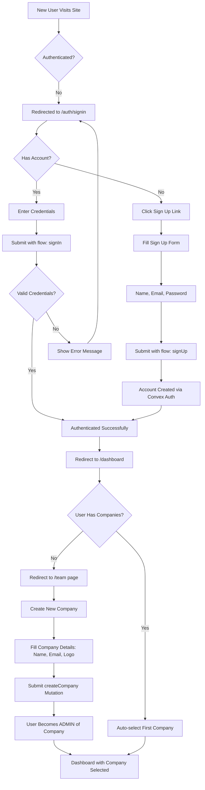
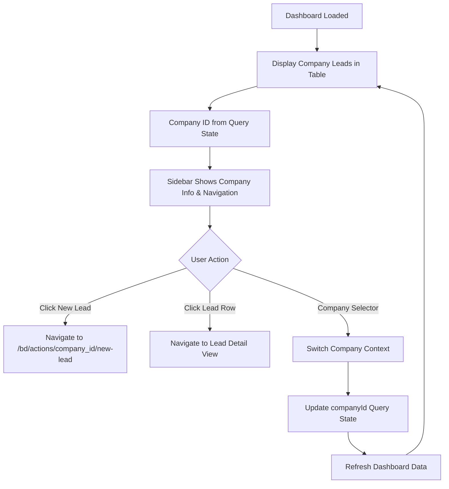
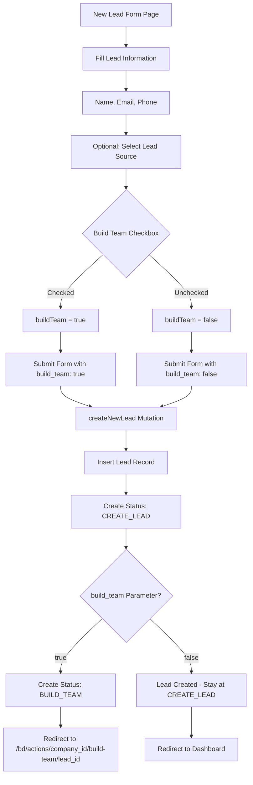
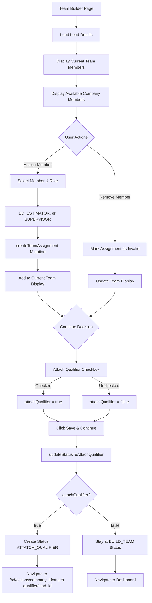
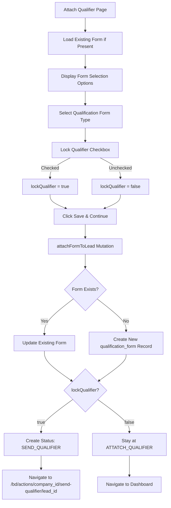
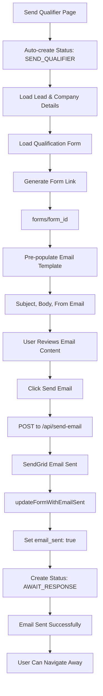
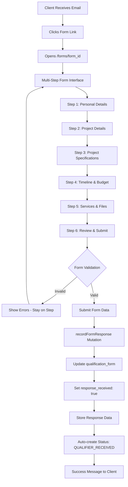
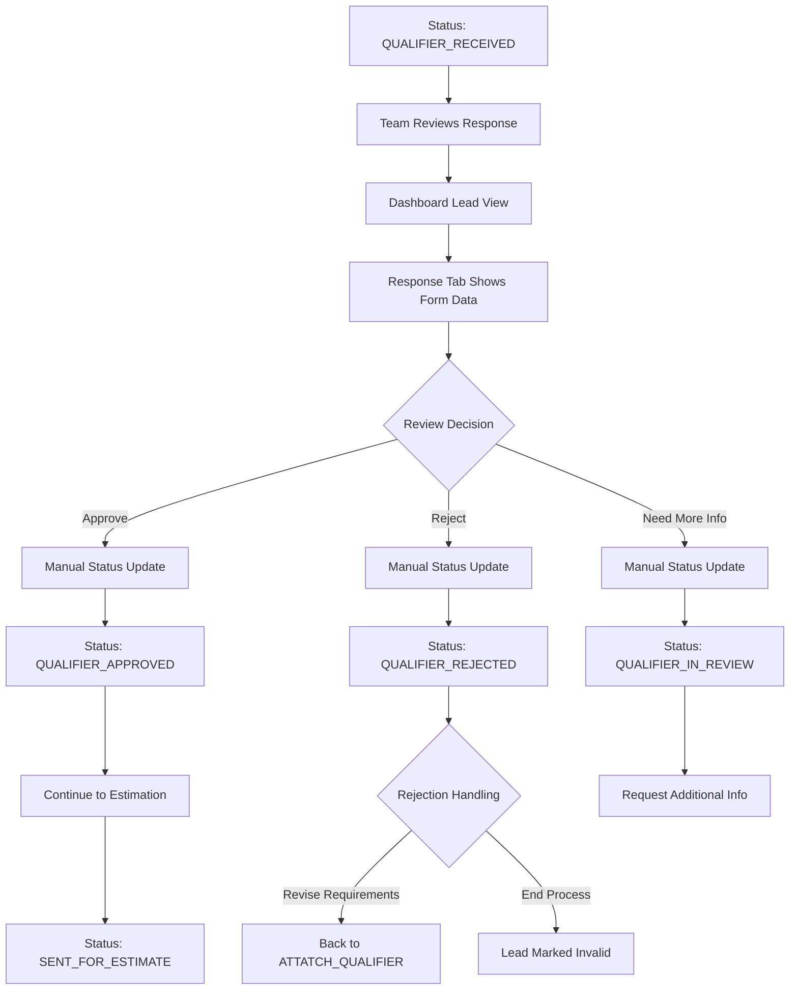
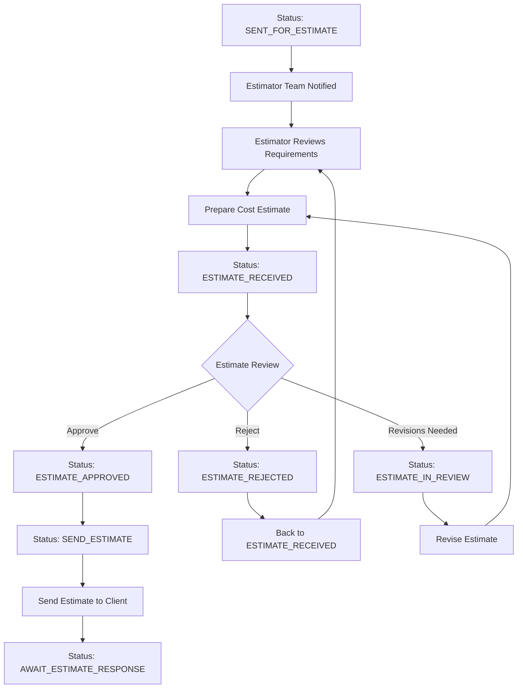
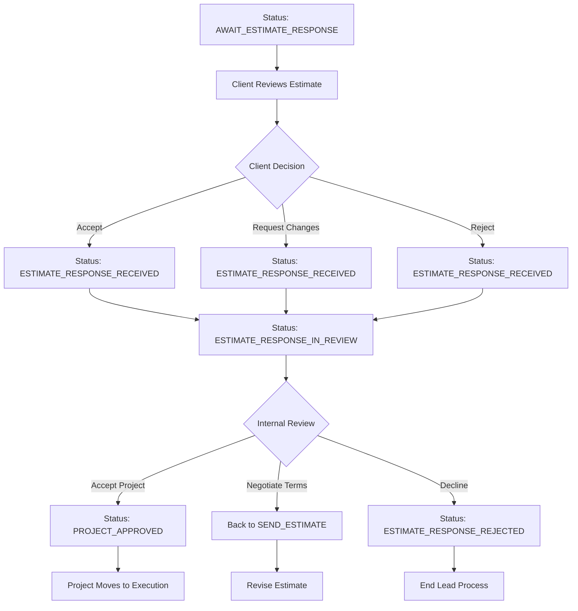

# Xylor Estimator Application - Complete User Flow

## Overview

This document maps the complete user journey through the Xylor Estimator application, from initial signup to lead completion, including all decision points, status transitions, and checkbox-based workflow controls.

## User Roles

- **ADMIN**: Company administrators who can manage leads, assign teams, and control workflows
- **USER**: Company members who can view data but have limited editing permissions
- **BD (Business Development)**: Handle initial lead contact and qualification
- **ESTIMATOR**: Technical assessment and cost estimation
- **SUPERVISOR**: Quality control and approval
- **CLIENT**: External users who fill out qualification forms

---

## Complete User Flow

### 1. Authentication & Company Setup

### 2. Dashboard & Lead Management

### 3. Lead Creation Flow

### 4. Team Building Flow

### 5. Qualifier Attachment Flow

### 6. Qualifier Sending Flow

### 7. Client Form Submission Flow

### 8. Internal Review Flow

### 9. Estimation Flow

### 10. Final Client Response Flow

---

## Status Transition Summary

### Sequential Status Flow

1. **CREATE_LEAD** → Lead created in system
2. **BUILD_TEAM** → Team members assigned (optional)
3. **ATTATCH_QUALIFIER** → Qualification form attached
4. **SEND_QUALIFIER** → Email sent to client
5. **AWAIT_RESPONSE** → Waiting for client form submission
6. **QUALIFIER_RECEIVED** → Client submitted form (automatic)
7. **QUALIFIER_IN_REVIEW** → Internal team reviewing
8. **QUALIFIER_APPROVED/REJECTED** → Review decision
9. **SENT_FOR_ESTIMATE** → Passed to estimation team
10. **ESTIMATE_RECEIVED** → Estimate prepared
11. **ESTIMATE_IN_REVIEW** → Estimate being reviewed
12. **ESTIMATE_APPROVED/REJECTED** → Estimate decision
13. **SEND_ESTIMATE** → Estimate sent to client
14. **AWAIT_ESTIMATE_RESPONSE** → Waiting for client decision
15. **ESTIMATE_RESPONSE_RECEIVED** → Client responded
16. **ESTIMATE_RESPONSE_IN_REVIEW** → Reviewing client response
17. **ESTIMATE_RESPONSE_APPROVED/REJECTED** → Final decision

### Checkbox Control Points

#### 1. New Lead Creation

- **Checkbox**: "Build Team in the next step"
- **Checked**: Redirects to team building, creates BUILD_TEAM status
- **Unchecked**: Returns to dashboard, stays at CREATE_LEAD

#### 2. Team Building

- **Checkbox**: "Attach qualifier in the next step"
- **Checked**: Creates ATTATCH_QUALIFIER status, redirects to qualifier attachment
- **Unchecked**: Returns to dashboard, stays at BUILD_TEAM

#### 3. Qualifier Attachment

- **Checkbox**: "Lock the qualifier and continue to next step"
- **Checked**: Creates SEND_QUALIFIER status, redirects to send qualifier
- **Unchecked**: Returns to dashboard, stays at ATTATCH_QUALIFIER

---

## Key Insights

### Automatic vs Manual Transitions

- **Automatic**: Form submissions trigger status changes automatically
- **Manual**: Review processes require human intervention
- **Checkbox-Driven**: User checkboxes control workflow progression

### Branch Scenarios

- **Skipped Steps**: Unchecked checkboxes allow skipping workflow steps
- **Rejection Paths**: Rejected items can loop back to previous steps
- **Dead Ends**: Some rejection paths end the lead process

### External Dependencies

- **Email System**: SendGrid integration for client communication
- **File Storage**: S3 integration for document uploads
- **Form System**: Public form endpoints for client access

### User Experience

- **Progressive Disclosure**: Complex workflows broken into manageable steps
- **Flexible Flow**: Checkboxes allow customization of process depth
- **Status Visibility**: Clear status indicators show current progress
- **Role-Based Access**: Different user types have appropriate permissions
