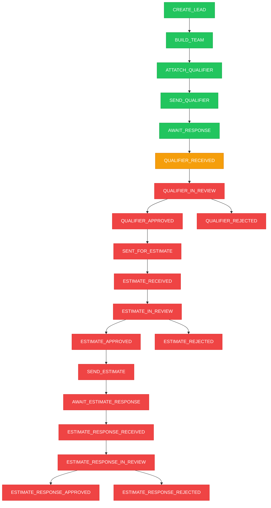

# Status Update Tracker

## Flow Diagram



## Status Implementation

| Status                        | File                | Function             | Status         |
| ----------------------------- | ------------------- | -------------------- | -------------- |
| `CREATE_LEAD`                 | `lead_service.ts`   | `createNewLead`      | ✅             |
| `BUILD_TEAM`                  | `lead_service.ts`   | `createNewLead`      | ✅             |
| `ATTATCH_QUALIFIER`           | `form_service.ts`   | `attachFormToLead`   | ✅             |
| `SEND_QUALIFIER`              | `SendQualifier.tsx` | `useEffect`          | ✅             |
| `AWAIT_RESPONSE`              | `SendQualifier.tsx` | `handleSendEmail`    | ✅             |
| `QUALIFIER_RECEIVED`          | `form_service.ts`   | `recordFormResponse` | 🔴 **MISSING** |
| `QUALIFIER_IN_REVIEW`         | -                   | -                    | ❌             |
| `QUALIFIER_APPROVED`          | -                   | -                    | ❌             |
| `QUALIFIER_REJECTED`          | -                   | -                    | ❌             |
| `SENT_FOR_ESTIMATE`           | -                   | -                    | ❌             |
| `ESTIMATE_RECEIVED`           | -                   | -                    | ❌             |
| `ESTIMATE_IN_REVIEW`          | -                   | -                    | ❌             |
| `ESTIMATE_APPROVED`           | -                   | -                    | ❌             |
| `ESTIMATE_REJECTED`           | -                   | -                    | ❌             |
| `SEND_ESTIMATE`               | -                   | -                    | ❌             |
| `AWAIT_ESTIMATE_RESPONSE`     | -                   | -                    | ❌             |
| `ESTIMATE_RESPONSE_RECEIVED`  | -                   | -                    | ❌             |
| `ESTIMATE_RESPONSE_IN_REVIEW` | -                   | -                    | ❌             |
| `ESTIMATE_RESPONSE_APPROVED`  | -                   | -                    | ❌             |
| `ESTIMATE_RESPONSE_REJECTED`  | -                   | -                    | ❌             |

## Critical Fix Required

**File**: `convex/form_service.ts`  
**Function**: `recordFormResponse`  
**Missing**: `QUALIFIER_RECEIVED` status creation

```typescript
// Current code (line 237-240)
const updatedForm = await ctx.db.patch(args.form_id, {
  response: args.response,
  response_received: true,
});

// Should add:
await ctx.db.insert("status", {
  name: "QUALIFIER_RECEIVED",
  lead_id: form.lead_id,
  status: "QUALIFIER_RECEIVED",
});
```

## Implementation Count

- **Implemented**: 5/20 (25%)
- **Missing**: 15/20 (75%)
- **Critical Bug**: 1 (breaks workflow)
