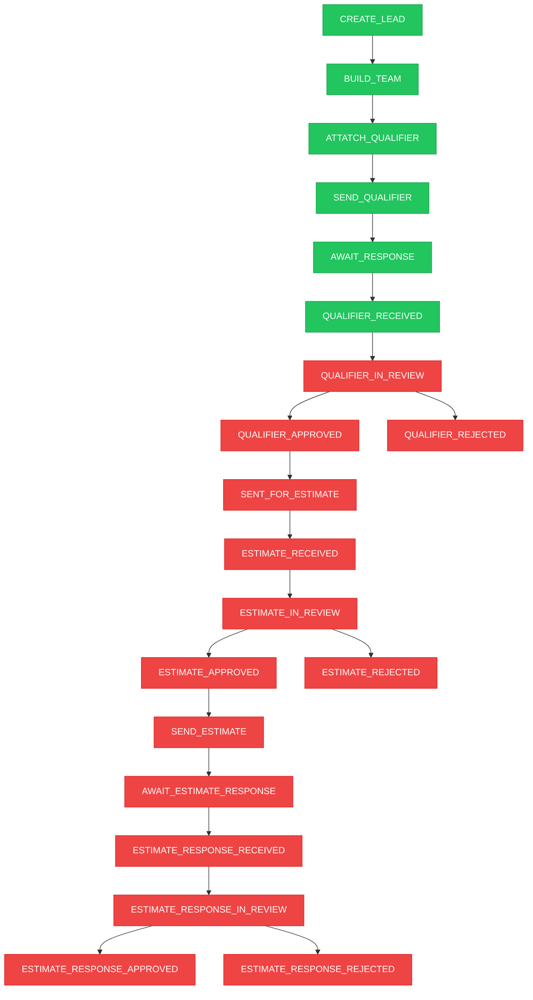

# Status Update Tracker

## Flow Diagram



## Status Implementation Details

### ✅ Implemented Status Updates

| Status               | Trigger Location              | Implementation | Function/Component       | Method                                            |
| -------------------- | ----------------------------- | -------------- | ------------------------ | ------------------------------------------------- |
| `CREATE_LEAD`        | Lead Creation                 | Backend        | `convex/lead_service.ts` | `createNewLead()` - Lines 28-33                   |
| `BUILD_TEAM`         | Lead Creation (conditional)   | Backend        | `convex/lead_service.ts` | `createNewLead()` - Lines 35-42                   |
| `ATTATCH_QUALIFIER`  | Team Assignment Complete      | Backend        | `convex/team_service.ts` | `updateStatusToAttachQualifier()` - Lines 140-144 |
| `SEND_QUALIFIER`     | Form Attachment (conditional) | Backend        | `convex/form_service.ts` | `attachFormToLead()` - Lines 47-51, 69-74         |
| `SEND_QUALIFIER`     | Manual UI Trigger             | Frontend       | `SendQualifier.tsx`      | `useEffect()` - Lines 72-80                       |
| `AWAIT_RESPONSE`     | Email Sent                    | Frontend       | `SendQualifier.tsx`      | `handleSendEmail()` - Lines 300-304               |
| `QUALIFIER_RECEIVED` | Form Response Submitted       | Backend        | `convex/form_service.ts` | `recordFormResponse()` - Lines 222-227            |

### ❌ Missing Status Updates

The following status updates are defined in the schema but not yet implemented:

- `QUALIFIER_IN_REVIEW`
- `QUALIFIER_APPROVED`
- `QUALIFIER_REJECTED`
- `SENT_FOR_ESTIMATE`
- `ESTIMATE_RECEIVED`
- `ESTIMATE_IN_REVIEW`
- `ESTIMATE_APPROVED`
- `ESTIMATE_REJECTED`
- `SEND_ESTIMATE`
- `AWAIT_ESTIMATE_RESPONSE`
- `ESTIMATE_RESPONSE_RECEIVED`
- `ESTIMATE_RESPONSE_IN_REVIEW`
- `ESTIMATE_RESPONSE_APPROVED`
- `ESTIMATE_RESPONSE_REJECTED`

## Implementation Architecture

### Status Service Pattern

The codebase uses a centralized `status_service.ts` with a `registerStatus` mutation:

```typescript
// convex/status_service.ts
export const registerStatus = mutation({
  args: {
    lead_id: v.id("lead"),
    statusName: statusTypeValidator,
    patch: v.optional(v.boolean()),
  },
  handler: async (ctx, args) => {
    // Prevents duplicate status creation
    // Uses patch=true to allow creation if not exists
  },
});
```

### Current Status Update Patterns

#### 1. **Backend Automatic Updates**

Status updates triggered by business logic:

- `CREATE_LEAD` → Always created on lead creation
- `BUILD_TEAM` → Created when `build_team: true` in lead creation
- `ATTATCH_QUALIFIER` → Created via team service when team assignment complete
- `SEND_QUALIFIER` → Created when form attached with `sendToNextStatus: true`
- `QUALIFIER_RECEIVED` → Created when form response recorded

#### 2. **Frontend Manual Updates**

Status updates triggered by user interactions:

- `SEND_QUALIFIER` → Set via UI when entering send qualifier page
- `AWAIT_RESPONSE` → Set after email successfully sent

#### 3. **Mixed Pattern (Form Attachment)**

The `attachFormToLead` function conditionally creates `SEND_QUALIFIER` status:

- When updating existing form with `sendToNextStatus: true`
- When creating new form with `sendToNextStatus: true`

## Data Flow Analysis

### Lead Creation → Team Building

```
CREATE_LEAD (auto) → BUILD_TEAM (conditional) → TeamAssigner UI → ATTATCH_QUALIFIER (via updateStatusToAttachQualifier)
```

### Qualifier Attachment → Sending

```
ATTATCH_QUALIFIER → AttachQualifier UI → SEND_QUALIFIER (conditional via attachFormToLead)
```

### Email Sending → Response

```
SEND_QUALIFIER (UI trigger) → SendQualifier UI → AWAIT_RESPONSE (after email sent) → ClientForm → QUALIFIER_RECEIVED (auto)
```

## Current Issues & Observations

### ✅ Fixed Issues

- **QUALIFIER_RECEIVED is now implemented**: Originally missing in `recordFormResponse`, now properly creates status on form submission

### 🔍 Design Patterns

1. **Conditional Status Creation**: Many status updates are conditional based on user choices (checkboxes, form parameters)

2. **Duplicate Prevention**: The `registerStatus` service prevents duplicate status creation for the same lead

3. **Mixed Triggers**: Some statuses can be created from multiple entry points (both backend logic and frontend UI)

4. **Frontend Status Management**: UI components directly manage status transitions using the `registerStatus` mutation

## Implementation Count

- **Fully Implemented**: 6/20 (30%)
- **Backend Implemented**: 5/6 implemented statuses
- **Frontend Implemented**: 2/6 implemented statuses
- **Missing Implementation**: 14/20 (70%)

## Next Implementation Priorities

### High Priority (Complete Current Workflow)

1. `QUALIFIER_IN_REVIEW` - Review workflow UI
2. `QUALIFIER_APPROVED`/`QUALIFIER_REJECTED` - Decision workflow

### Medium Priority (Estimation Workflow)

3. `SENT_FOR_ESTIMATE` - Estimate request workflow
4. `ESTIMATE_RECEIVED` - Estimate submission
5. `ESTIMATE_IN_REVIEW`, `ESTIMATE_APPROVED`/`ESTIMATE_REJECTED` - Estimate review workflow

### Low Priority (Client Response Workflow)

6. `SEND_ESTIMATE` through `ESTIMATE_RESPONSE_REJECTED` - Client-facing estimate workflow

## Technical Recommendations

1. **Centralize Status Updates**: Consider moving all status updates to use the `registerStatus` service for consistency

2. **Add Status Validation**: Implement business logic to prevent invalid status transitions

3. **Frontend State Management**: Consider adding status change notifications/confirmations in UI

4. **Audit Trail**: Current implementation doesn't track who/when status changes occurred
